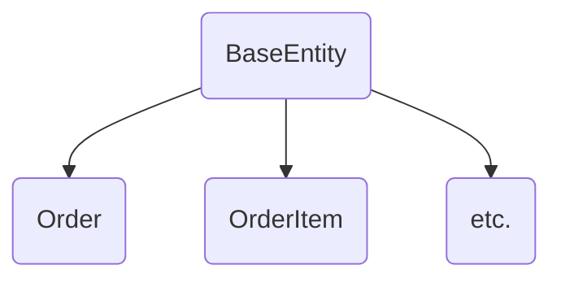

> Why can't I implement this interface?

Disregard the jargon in the title and just think with me,
why can't I implement this interface?

# First, Let's introduce the players



We have some entities that extent `BaseEntity` with some shared fields.
Also, we have a type `CustomField` that is extended by subclasses per entity,
so we have `OrderCustomField` and `OrderItemCustomField`.
Till now there is no problem.

The problem started when we were editing a generic method that dealt with only *some*
of the subclasses of `BaseEntity` (All of which has `CustomFields`).

```csharp
public void T Method<T>(List<T> entities) where T : BaseEntity
{
}
```

Now this generic method deals with only the classes that have `CustomFields`
and the question is how can we add that since not all subclasses
of `BaseEntity` have Custom fields we can't add it there,

So, there is only one solution left Interfaces, Should be easy right?

# Part One: The Custom Fields Interface

```csharp
public interface ICustomFieldEntity : IBaseEntity {
    public List<CustomField> CustomFields;
}
```

looks okay right?

Now Order can just implement this interface like this:

```csharp
public class Order : BaseEntity, ICustomFieldEntity {
    public List<OrderCustomField> CustomFields;
}
```

and Order Item:

```csharp
public class OrderItem : BaseEntity, ICustomFieldEntity {
    public List<OrderItemCustomField> CustomFields;
}
```

the code looked okay, but the compiler wasn't okay with that.

> Type `OrderCustomField` doesn't match the expected type `CustomField`

this was weird to say the least.

why was the compiler complaining isn't `OrderCustomField` a subclass of `CustomField`?
Shouldn't subclasses be able to replace their super class?

Isn't this [LSP](https://en.wikipedia.org/wiki/Liskov_substitution_principle)?

Was SOLID just a **lie**?

***

# Part Two: Generics to the rescue

No need to worry, no need to even understand the problem let's solve it quickly by introducing a generic type on out
interface

```csharp
public interface ICustomFieldEntity<T> : IBaseEntity {
    public List<T> CustomFields;
}
```

and order will implement the interface while specifying the custom field type

```csharp
public class Order : BaseEntity, ICustomFieldEntity<OrderCustomField> {
    public List<OrderCustomField> CustomFields;
}
```

looks good, compiles so even better 👍.

but what about our actual task?
we will need now to add a new generic to the method, something like this

```csharp
public void T Method<T, TCustom>(List<T> entities) where T : ICustomFieldEntity<TCustom>
{
}
```

then it hit me, we now need to *Explicitly* pass this new type to **EVERY** call to this method like so;

```csharp
Method<Order, OrderCustomField>(orders);
```

when we had the generic T it was inferred by the compiler when we called the method, but now we need to pass it
everywhere, how many are these calls you ask?

a small search from the IDE told me it was 38 🤦.

Now I had some options:

1. bloat my codebase with redundant types everywhere.
2. Try to force a way for C# to dynamically determine the type of TCustom based on T.
3. Actually understand the problem.

as a good software engineer I decided to try option 3 and ~~ask AI~~ search online (which wasn't that helpful and I
really understood after reading the book).

***

# Part Three: You are NOT the Father

> this and next sections are with a great help from CH.15
> from [this](https://www.amazon.com/Functional-Object-Oriented-Concurrent-Programming-Charpentier/dp/0137466544) great
> book.

Liskov substitution principle states that:

> Let `Φ(x)` be a property provable about objects `x` of type `T`. Then `Φ(y)` should be true for objects `y` of type
`S` where `S` is a subtype of `T`.


yeah, not helping much.

after some memory refreshing we can say that LSP (in English) says:
> The principle defines that objects of a superclass shall be replaceable with objects of its subclasses without
> breaking the application. That requires the objects of your subclasses to behave in the same way as the objects of
> your
> superclass.

okay makes perfect sense, now why cant my `List<OrderCustomField>` implement the property `List<CustomField>`?

now here is tha catch:

`OrderCustomField` extends `CustomField`. but `List<OrderCustomField>` is not a subtype of `List<CustomField>`.


now I have one question, WHY?

well think of this function for example

```csharp
public void PrintCountAndAddOrderLine(List<CustomField> customFields){
    Console.WriteLine(customFields.Count);
    customFields.Add(new OrderLineCustomField());
}
```

notice the second line, the one where I am adding an object with type `OrderLineCustomField`.
Now think what will happen If I tried to call this function on a list of `OrderCustomField`?

And that ladies and gentlemen is why C# list are *Invariant*

# Part Four, What is Covariance